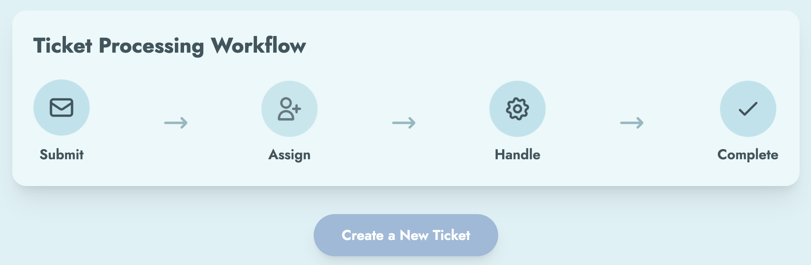
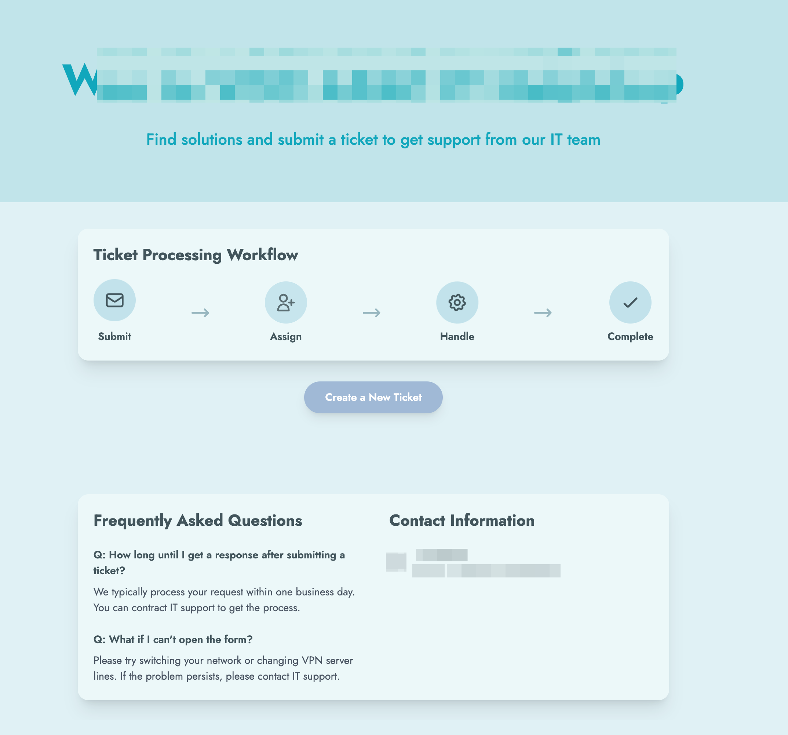
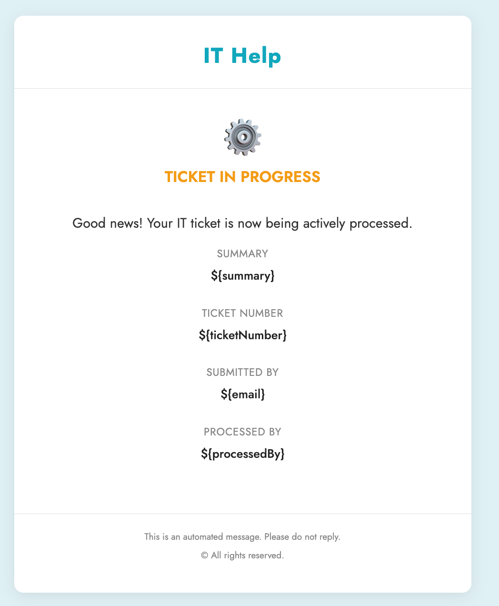
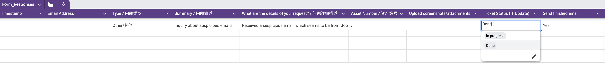

# 🛠️ Serverless IT Ticket System (Google Workspace)

[](./README_CN.md)


> **[ 🇨🇳 点击这里查看中文版 (Click here for Chinese Version) ](./README_CN.md)**

## 📖 Overview

This is a fully functional, **Serverless IT Service Management (ITSM)** solution designed for Small and Mid-sized Businesses (SMBs). 

Built entirely within the **Google Workspace** ecosystem, it provides a centralized portal for employees to submit issues and a structured backend for IT staff to manage tickets, track SLAs, and automate email notifications—all without incurring additional software costs (like Jira or ServiceNow).

## 🏗️ Architecture & Workflow

The system follows a headless architecture pattern utilizing low-code tools:

1.  **Frontend (Portal)**: **Google Sites** serves as the intranet entry point.
2.  **Input (Submission)**: **Google Forms** collects structured data (Issue Type, Asset ID, Attachments).
3.  **Database (Backend)**: **Google Sheets** acts as the real-time database.
4.  **Automation (Logic)**: **Google Apps Script** handles business logic, state changes, and notifications.

### Visual Workflow


---

## ✨ Key Features

*   **🎨 Self-Service Portal**: A user-friendly interface for employees to find FAQs and submit tickets.
*   **🆔 Auto-Ticketing**: Automatically generates unique Ticket IDs based on date and sequence (e.g., `TCK26011901`).
*   **📧 HTML Email Notifications**:
    *   **User**: Receives confirmation when ticket is created, processing, or resolved.
    *   **IT Admin**: Receives alerts with asset details and direct attachment links.
*   **🔄 State Machine Logic**: 
    *   Changing status to `In Progress` triggers a specific user notification.
    *   Changing status to `Done` closes the loop and records the completion timestamp.
*   **📊 Idempotency**: Prevents duplicate emails for the same status update using flag columns.

---

## 📸 Screenshots

### 1. IT Support Portal (Google Sites)
*Centralized hub for ticket submission and knowledge base.*


### 2. Automated HTML Notifications
*Professional email templates sent automatically via Apps Script triggers.*


### 3. Admin Database (Google Sheets)
*IT Staff view for managing status and tracking SLAs.*


---

## 💻 Code Logic (Google Apps Script)

The core automation is handled by `src/Backend_Logic.js`.

### Trigger 1: New Ticket Submission (Ingress)
When a form is submitted, the script:
1.  Calculates a unique ID based on the current date.
2.  Parses form data (including Drive attachments).
3.  Sends a formatted HTML email to the IT Support Team.

### Trigger 2: Status Update (Event-Driven)
The script listens for edits in the **Status** column to trigger downstream actions:

```javascript
function onEdit(e) {
  // Logic to detect status change to "Done"
  if(status === "Done" && prevStatus !== "Done" && !isNotified) {
     // Send Resolution Email with HTML Template
     MailApp.sendEmail({
       to: userEmail,
       subject: `Ticket Resolved: ${ticketID}`,
       htmlBody: getHtmlTemplate_Resolved(ticketID)
     });
     // Mark as notified to prevent duplicate actions (Idempotency)
     sheet.getRange(row, COLS.NOTIFY_DONE).setValue("Yes");
  }
}